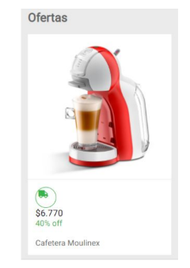
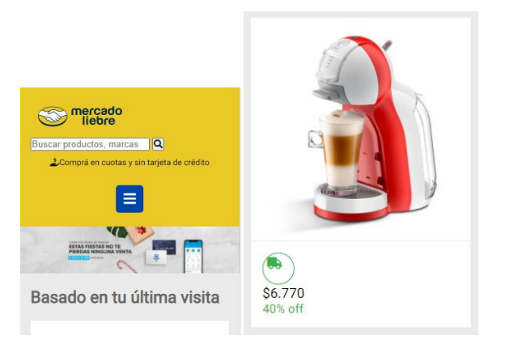
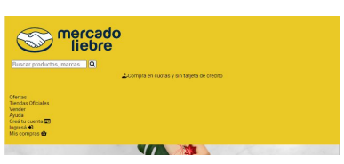

# Trabajo Practico numero 3 - Mercado Liebre - Diseño Adaptatico.

## Desafio 1: 
- Debemos centrar la sección main y que ocupe un 90% del ancho de la pantalla.
- Entre cada artículo hay una separación de 10 píxeles.
- Nos piden que manejemos el logo del envío, el precio, el porcentaje de descuento y la descripción del artículo como elementos de una caja dentro de la caja general del artículo.
- Nos piden que la misma tenga un borde superior de 1 píxel, línea sólida y color #ebebeb.
- Debe tener separado el contenido de sus bordes en 15 píxeles en cada uno de sus lados.

********************************************************************************************************

Mockup del Desafio:

*********************************************************************************************************

## Desafio 2: debemos implementar los siguientes puntos de corte.
- Navegación en tablets (ancho mínimo 361 px).
- Navegación en desktop (ancho mínimo 769 px).
- Solo en el caso mobile la descripción del artículo no se visualizará.
- Agregar box-shadow. Para los dispositivos tablet o de resoluciones superiores.

## Desafio 3: Para la sección del Header debemos.
- Solo para la versión mobile, ocultar el site y el login navbar.
- Para las versiones desktop y tablet mostrar el site y login navbar, pero ocultar la imagen del menú hamburguesa.

## Resultados esperados

***************************************************************************************************************

### Version Mobile:

****************************************************************************************************************

### Version Desktop y Tablet:

*****************************************************************************************************************